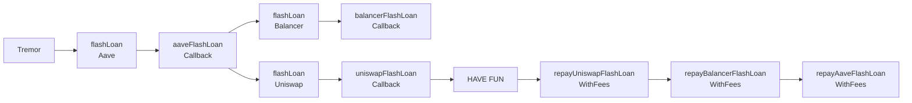

# flashgod

__$22B in crypto across 7 transactions as-a-service__ (as of crypto prices on 6:30 am UTC, 29th Nov 2024).


## Wait wut?!
__flashgod__ is a light-weight flash-loan aggregator on all EVM compatible chains (with size), that provides __unbridled__ access to __all__ available assets of __all__ flash-loan providers on 7 different chains, *__in 1 transaction per chain__*, on a clean and easy-to-use interface,

featuring flash-loan providers:
- Aave V3
- Uniswap V3
- Balancer V2

on chains:
- Ethereum
- Arbitrum
- Optimism
- Polygon
- Base
- Avalanche
- BSC


## How?
Nothing new, but connecting existing dots. Simply a chain of callbacks initiating flashloans from one provider to the next. 

Things get particularly interesting for Uniswap V3, where flashloans have to be borrowed from multiple pools in a single transaction, in a gas-efficient manner. _flashgod_ does so by recursively calling its uniV3 flashloan initiator function from its callback, with clever use of transient storage to keep things light.


like so:

```
Tremor -> flashLoan(Aave) -> aaveFlashLoanCallback() -> flashLoan(Balancer) -> balancerFlashLoanCallback() -> flashLoan(Uniswap) -> uniswapFlashLoanCallback() -> HAVE FUN -> repayUniswapFlashLoanWithFees() -> repayBalancerFlashLoanWithFees() -> repayAaveFlashLoanWithFees()
```



Things become more interesting for the case of Uniswap's flash loans. Unlike Aave and Balancer, we can't borrow all assets in one call, coz every UniV3 pool needs to be borrowed from individually (cause of the design of UniV3 architecture, where liquidity even for a given asset lives in different pools with different fee tiers).

Tremor solves this by recursively calling the uniswap flashloan initiator function from its callback, and then calling the same function again from the next callback, and so on, until flashloans are borrowed from all the pools, while using transient storage to access data of all the pools to flashlaon from, across sub-contexts of the recursive calls, instead of using storage to lighten the gas costs.

Updating the callchain above like so:
```
Tremor -> flashLoan(Aave) -> aaveFlashLoanCallback() -> flashLoan(Balancer) -> balancerFlashLoanCallback() -> flashLoan(Uniswap, 1) -> uniswapFlashLoanCallback(1) -> flashLoan(Uniswap, 2) -> uniswapFlashLoanCallback(2) -> ...uniswapFlashLoanCallback(n) -> HAVE FUN -> repayUniswapFlashLoanWithFees(n) -> repayUniswapFlashLoanWithFees(n-1) -> ...repayUniswapFlashLoanWithFees(1) -> repayBalancerFlashLoanWithFees() -> repayAaveFlashLoanWithFees()
```

## Hot Stuff

Some cool tricks used by flashgod to achieve its goals:
- semi-statelessness: one of the key goals of flashgod was to be as feather-weight as possible, meaning almost 0 use of storage state. The 1-transaction nature of aggregating flashloans aligned elegantly with the killer feature of transient storage being persistent for exactly 1 transaction. This allowed flashgod to share metadata of flashloan providers across various calls, and also to remember all the assets it received, with their amounts.
- hash-set: the key-value nature of transient storage allows for a simple implementation of 2 sets of mappings, 1 to allow adding assets to hash-set in O(1) time, and the other to iterate over all the unique assets to be able to execute strategies using them in O(n) time. Together, looking like an iteratable hash-set.
- yul-magic: using yul wherever sensibly possible to reduce gas, notably for decoding bytes array of pool data of all UniV3 pools and storing them in transient storage, in a way that allows for simple and quick access 

## Usage

## Credits
Opening GIF Credits: [A.L.Crego](https://x.com/ALCrego_/status/1860242375118888960)

## Legal
This software is provided "as is", without warranty of any kind. Use at your own risk. The author is not liable for any damages incurred while using this software. 
